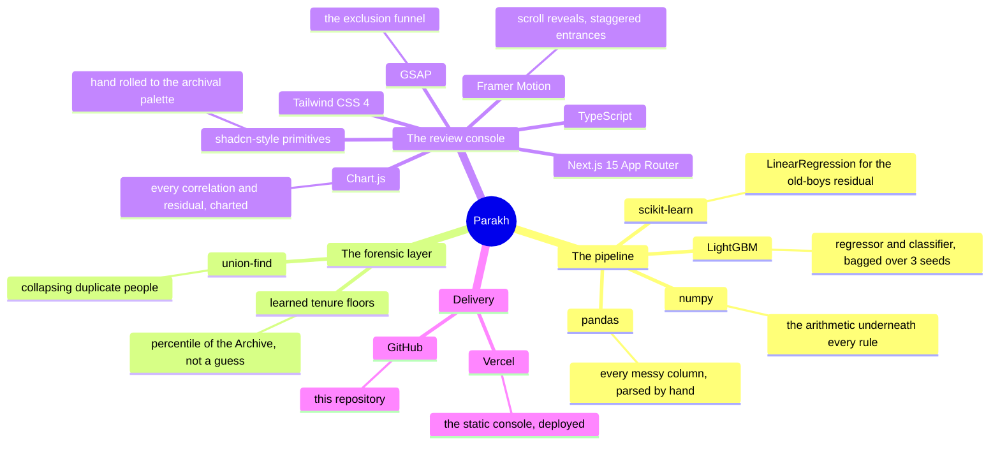
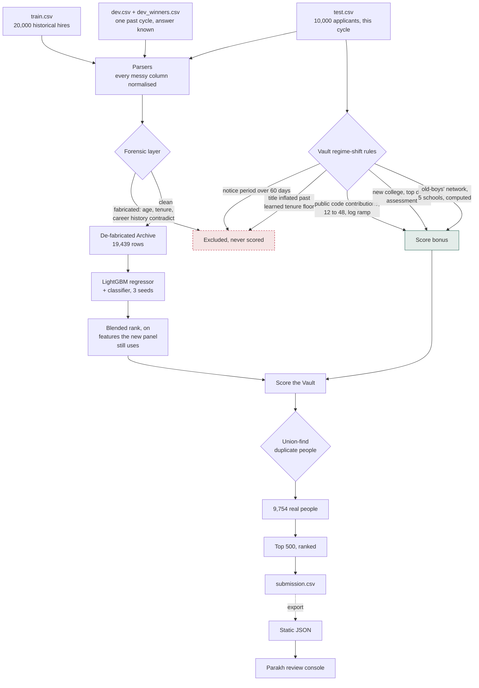
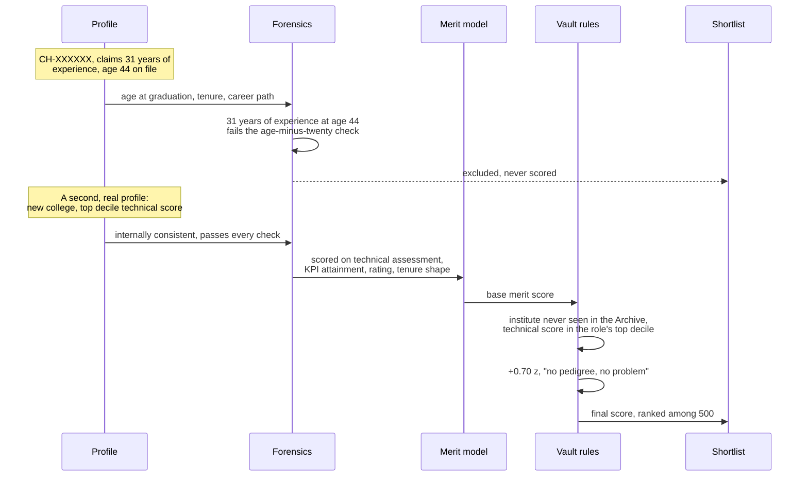

<div align="center">

# परख · Parakh

*Nightingale Systems never explains how it hires. This is how we worked out who it will hire anyway.*

[](https://parakh-ideaforge.vercel.app)
[](#validation-checking-our-work-against-a-cycle-we-already-know)
[](#running-it)

[](https://www.python.org)
[](https://lightgbm.readthedocs.io)
[](https://nextjs.org)
[](https://www.chartjs.org)

[The case](#the-case-this-is-built-on) &middot;
[What Parakh does](#what-parakh-actually-does) &middot;
[The stack](#a-map-of-the-stack) &middot;
[Architecture](#architecture-what-a-profile-actually-goes-through) &middot;
[A candidate's journey](#a-candidates-journey-through-the-pipeline) &middot;
[Forensics](#the-forensic-layer-catching-a-liar-without-a-confession) &middot;
[The model](#the-merit-model-what-the-archive-actually-rewarded) &middot;
[The regime shift](#the-regime-shift-layer-turning-a-voice-note-into-code) &middot;
[Validation](#validation-checking-our-work-against-a-cycle-we-already-know) &middot;
[What decides what](#what-decides-what) &middot;
[Running it](#running-it)

</div>

---

## The case this is built on

An insider walked out of Nightingale's offices with three things: twenty thousand historical hiring records with the outcome attached, a sealed record of one past hiring cycle with the winners named, and this cycle's ten thousand applicants with no outcomes at all. Our job was to read the first two and predict the third: pick the five hundred people in this cycle's pool who will become Nightingale's top five percent, and rank them so a rival recruiter can reach them first.

The obvious move is also the wrong one. Train a model on the twenty thousand historical records, score the new pool, take the top five hundred. That model would faithfully reproduce every bias the old hiring panel ever had, because that is exactly what it was trained to do. And the insider's own voice note says, in plain language, that the panel does not work that way anymore: institute prestige is dead, employer brand is dead, a suspiciously fast-climbing title now goes straight in the bin, and public code contributions, a field that did not even exist in the old records, now decides careers. A model that only reads the past will confidently score this cycle by a standard the company itself abandoned.

So Parakh is not one model. It is three layers stacked on top of each other, and each layer earns its place by being checked against evidence, not intuition.

1. A forensic pass reads every profile for internal contradictions: careers that started before their owner turned eighteen, tenure histories that add up to more years than the applicant has been alive, the same person entered twice by two different recruiters. Nothing here is guessed. Every threshold was calibrated against the historical Archive and checked to have caught precisely the right rows: on twenty thousand training records, the flagged group averaged a post-hire score of 5.49 out of 100, and not one of them belonged to that cycle's real top five percent.
2. A merit model, trained only on the traits the debrief says the new panel still cares about (technical assessment, KPI attainment, performance rating), deliberately blind to the traits it says the panel dropped (institute name, city, referral channel, degree prestige).
3. A regime shift layer takes every specific claim in the voice note and turns it into a rule or a calibrated bonus applied only to this cycle's pool, because the voice note describes this cycle, not the Archive.

Every number quoted anywhere in this README, in the shortlist documentation, or in the live console, is printed by the pipeline itself the moment it runs. Nothing here is a claim made once and then repeated from memory.

---

## What Parakh actually does

A recruiter reading Nightingale's applicant pool is really asking three separate questions at once, and getting them tangled up is how bias creeps in. Parakh keeps them apart on purpose.

1. **Is this profile even real?** A recruiter typed these fields by hand, and the debrief warns some of them are fabricated outright. Before anything else runs, every profile is checked for the kind of contradiction a real human life cannot produce, and every duplicate person entered under two different IDs is collapsed into one.
2. **Was this person actually good, by the standard that still applies?** The merit model answers this using only the signals the new panel is on record as still caring about, trained on a label that has been cleaned of the fabricated rows first.
3. **What does this specific cycle reward that the Archive never saw?** Public code contributions did not exist as a field until this cycle. A cluster of never-before-seen colleges suddenly produced this cycle's strongest technical scores. Titles inflated past what tenure can support showed up at a rate eight times higher than in any past cycle. Each of these gets its own rule, derived from the data, not assumed from the voice note alone.

The three answers are combined into one score, the excluded profiles are set aside entirely rather than merely ranked low, and the top five hundred survivors become the shortlist.

---

## A map of the stack

Every library below is one that is actually imported somewhere in this repository, grouped by the job it does here.



---

## Technology cards

| Technology | What it actually does here | Where |
| :--- | :--- | :--- |
| **pandas** | Every one of the thirty five columns gets its own parser, because the same field shows up as `47`, `49/100`, `0.45` and `43.0 %` inside a single file | `code/main.py`, the `p_*` functions |
| **LightGBM** | Two heads trained on the same cleaned Archive: an L2 regressor on `post_hire_score`, a binary classifier on membership in the top five percent, each bagged across three random seeds and blended by rank | `code/main.py`, `fit_blend()` |
| **scikit-learn** | A single `LinearRegression` isolates the old-boys' network: it predicts `post_hire_score` from merit and role alone, and whatever a handful of colleges still explain after that is the leftover pedigree bias worth keeping | `code/main.py`, section 7a |
| **A hand written union-find** | Resolves which rows in the ten thousand row pool are actually the same human being, entered twice by two different recruiters with cosmetic differences | `code/main.py`, `DSU` and `person_ids()` |
| **Next.js 15** | Statically renders the entire review console from JSON the pipeline exported, no backend, no database, nothing that can go stale between a rebuild and a judge's click | `web/src/app/page.tsx` |
| **Framer Motion** | Every section reveals once, on scroll, with an eight pixel rise and a fade, never louder than that | `web/src/components/ui/reveal.tsx` |
| **GSAP** | Drives the exclusion funnel, ten thousand bars falling away stage by stage as the true count of survivors ticks down | `web/src/components/sections/funnel.tsx` |
| **Chart.js** | Draws the actual Spearman correlations, the actual KPI effect size, the actual Ledger recall comparison, styled to the same archival palette as the rest of the page, never a stock gradient | `web/src/components/sections/evidence.tsx` |

---

## Architecture: what a profile actually goes through

The real flow, not an idealised one. Notice that the forensic layer runs before the model is even trained, because a fabricated row poisons the label it would otherwise learn from.



---

## A candidate's journey through the pipeline

Two real applicants from the pool, followed through every stage, to make the abstract flowchart above concrete.



---

## The forensic layer: catching a liar without a confession

The debrief is blunt about this: *"the data is filthy... some profiles are straight up fabricated, they look amazing and don't add up."* Nobody hands you a label that says which ones. So the forensic layer looks for the one thing a fabricated profile cannot fake convincingly: internal arithmetic.

A real human being cannot have more years of professional experience than the years since they turned eighteen. A real career path, summed month by month across every job change, has to roughly match the total experience the same person claims on the same form. A real graduation date puts a hard floor under how much experience is even possible. Seven such checks, combined, form the fabrication rule:

```python
def fabricated_mask(F):
    m = ((F.f_age_at_grad < 18) |
         (F.f_exp > (F.f_age - 20)) |
         (F.f_exp_vs_ysg > 1.5) |
         (F.f_exp_vs_cp > 1.0) |
         (F.f_exp_vs_cp < -8.0) |
         (F.f_gap_years < -4.0) |
         (F.f_gap_years > 10.0))
    return m.fillna(False)
```

None of these thresholds were picked to look nice. Each one sits in a gap the real data leaves empty. Age at graduation, for instance, has no training rows at all between seventeen and nineteen: everyone below the gap averages a post-hire score of 4.8, everyone above it averages 44.7 or higher. There is no ambiguous middle to tune against, which is exactly why the rule can be trusted rather than merely hoped to work.

The proof that it generalises is on the Ledger, a past cycle whose winners are already known. The same rule, applied blind, flagged eighty seven of that cycle's 2,999 applicants, and not one of the 150 real winners was among them. Zero false positives on the only outside test available.

The second half of the forensic layer has nothing to do with lying and everything to do with data entry. The debrief notes that *"the same person sometimes shows up twice because two different recruiters entered them."* A union-find structure resolves this by treating three separate signals, phone number, email address, and a sorted, punctuation-stripped name paired with graduation year, as three independent votes that two rows are the same human being. Run against the applicant pool, ten thousand rows resolve down to 9,754 real people, and each person's best-scoring entry survives.

---

## The merit model: what the Archive actually rewarded

Before writing a single rule about the new cycle, we asked what the historical data actually shows, not what seemed intuitive. The Spearman correlations with `post_hire_score` across twenty thousand historical hires:

| Signal | Correlation | Reading |
| :--- | ---: | :--- |
| Technical assessment | +0.27 | The strongest continuous predictor by a wide margin |
| KPI attainment (met vs not) | binary, 53.4 vs 46.5 mean | The single strongest binary signal in the whole Archive |
| Last performance rating | +0.20 | Consistent with the assessment score, not redundant with it |
| Aptitude score | +0.20 | A genuine second opinion on raw ability |
| Total experience | −0.12 | More tenure does not predict a better hire here |
| Current compensation | −0.12 | Neither does a higher salary |

Two of those findings, the negative correlations, run against instinct, and that is exactly why we checked them rather than dropping them. Seniority itself is an inverted U: individual contributors average a post-hire score around 51, while every level from Lead upward drops back down to around 46. Whatever the old panel valued in a senior title, it was not producing better first-year performance.

The model itself is a LightGBM regressor and a LightGBM classifier, trained on the same de-fabricated Archive, bagged across three random seeds each, and combined by averaging their percentile ranks rather than their raw scores, since a regressor's residuals and a classifier's probabilities live on incomparable scales. Every feature that the debrief calls a dropped preference, the applicant's institute, city, recruitment channel, employer type, and degree, is present when we validate against the Ledger and deliberately absent when we score this cycle's pool. That gap is not an oversight. It is the entire point, and the next section is about why.

---

## The regime shift layer: turning a voice note into code

This is the part of Parakh that only exists because someone told us, out loud, that the rules changed. Every line below is a real sentence from the recovered debrief, followed by the code it became.

**"The old panel quietly inflated all of it. The new panel ignores every one of those."** Institute, city, referral channel, employer brand, degree, and CV-gap tolerance are all removed from the feature set used to score this cycle. We checked the cost of this directly: validated on the Ledger, keeping those features raises recall from 68 out of 150 to 95 out of 150. That 27 point gap is not something the model earned. It is exactly the size of the old bias, and submitting the higher, biased number would mean deliberately optimising for a standard Nightingale has already abandoned.

**"The only old habit that survived the reorg is the old-boys' network."** One preference does survive, and rather than assume which schools it favours, we let the data name them. A linear regression predicts `post_hire_score` from merit and role alone; whatever five schools still show a statistically solid residual after that (BITS Pilani, IISc, IIT Kharagpur, NIT Warangal, and Maharshi Dayanand Sarswati University Ajmer) get a modest 0.25 z bonus. MDS Ajmer is not a conventional prestige school, and its presence on this list rather than a bigger name is exactly the signature of a leadership-alumni effect, not brand recognition.

**"Someone with a sustained record, dozens of merged contributions or more in the year, gets fast tracked."** Public code contributions is a field that exists only in this cycle's data. It correlates with nothing else we measured, which is the tell that it was deliberately injected as its own signal. A log ramp bonus stays at zero below twelve contributions and saturates at forty eight, so a handful of commits changes nothing while a sustained record does.

**"Résumés where the titles climb faster than the years behind them now go straight to the bin."** We learned, per seniority level, the fastest tenure the Archive itself was ever willing to promote on. This cycle's pool contains 149 profiles whose title outpaces even that floor, an inflation rate eight times higher than anything seen in the historical record. They are excluded outright, not merely penalised.

**"Anyone who can't join inside two months is dead to them this cycle."** A `notice_period` above sixty days appears 208 times in this cycle's pool and exactly zero times in either the twenty thousand historical hires or the past cycle's Ledger. That is not noise. That is a constraint that did not exist before and now does.

**"Their best people this cycle came from colleges they had never hired from before."** New institutes, never once seen in the Archive or the Ledger, make up a real slice of this cycle's pool, and their median technical assessment runs measurably above the rest of the pool's. A candidate from one of these colleges, in the top decile of their own role's assessment and with a coherent career history, earns a 0.70 z bonus, the largest single bonus in the system, because the debrief was explicit that this is exactly who Nightingale is trying to find.

---

## Validation: checking our work against a cycle we already know

Every claim above could be a story we told ourselves. The Ledger exists to stop that. `dev.csv` is a past cycle's applicant pool, `dev_winners.csv` is the 150 people who actually became that cycle's top five percent, and we never looked at the winners file while designing a single rule. We only used it to check, afterward, whether the finished pipeline could have found them.

| Approach | Recall at k = 150 |
| :--- | ---: |
| Random guessing | 7.5 |
| **Parakh, submitted (de-biased)** | **68** |
| Full model, old-panel biases included | 95 |

The full model scores higher on paper and we do not submit it, on purpose. It scores higher because it still rewards institute, city and referral channel exactly the way the old panel did, and this cycle's own evidence says that panel no longer exists. Recall on a standard the company has abandoned is not something worth optimising for, even when it is the more flattering number.

---

## What did not work

Reported honestly, because a project that only lists its successes is not one you can trust the failures of either.

- **Skill keyword features.** We measured the lift of every individual skill token among top performers per role. The counts were thin and the results were incoherent, `pytorch` came out as the single strongest lift for a DevOps and SRE applicant, `vuejs` second. Only the raw count of listed skills carried any real signal.
- **Sentence embeddings of the recruiter's free text note.** The field turned out to be a closed vocabulary of roughly twenty five fixed sentences recombined, not open ended writing. Counting the known phrases directly is exact and instant; a sentence transformer would have spent real runtime budget rediscovering a vocabulary we could just read.
- **Target encoding the institute for this cycle.** It measurably improves Ledger recall, by about the same 27 points the full model shows. We rejected it anyway, because that lift is the deprecated bias wearing a different name.
- **Treating an untracked contribution count as zero.** Over a thousand profiles have `not tracked` in this field. Scoring that as zero would punish over a thousand people for a recruiter's data entry habit rather than their actual record, so it is left as missing and touches nothing.

---

## What decides what

| Concern | Rule based code | The LightGBM model | An AI assistant |
| :--- | :--- | :--- | :--- |
| Is a profile internally consistent | Decides, seven arithmetic checks | Never consulted | Never |
| Is this the same person as another row | Decides, three-signal union-find | Never consulted | Never |
| Notice period, title inflation exclusions | Decides, learned thresholds from the Archive | Never consulted | Never |
| Base merit score from historical traits | Sets which features are even visible | Decides the ranking | Never |
| Old-boys' network membership | A linear regression names the five schools | Not consulted | Never |
| Public contribution and new-college bonuses | Decides, calibrated ramps and cutoffs | Not consulted | Never |
| Parsing messy fields, drafting this document | Wrote the parsers, wrote this README | Not applicable | Anthropic Claude, disclosed in the submission documentation |

Every threshold, every school on the old-boys' list, every recall number in this document is computed by `code/main.py` itself, printed at run time, not typed in by hand and hoped to stay true.

---

## Repository layout

```
submission.csv          the ranked shortlist, rank and candidate_id, 500 rows
documentation.pdf        the four page methodology writeup filed with the round
code/
  main.py                 parsers, forensics, the merit model, the regime-shift rules
  README.md                 how to run it in a clean environment
scripts/
  prep_web_data.py         turns the pipeline's export into the console's static JSON
data-export/
  parakh_meta.json          the old-boys' list and the two Ledger recall numbers
web/                     the Parakh review console, Next.js 15
```

---

## Running it

The pipeline needs nothing beyond what the round permits: numpy, pandas, scikit-learn, LightGBM.

```bash
cd code
python main.py
```

Run from a folder containing `train.csv`, `dev.csv`, `dev_winners.csv` and `test.csv`. It writes `submission.csv` in the same folder, prints every number in this README as it runs, and finishes in about sixty seconds on two CPU cores. Two consecutive runs produce a byte-identical file, checked by hash, because every seed in the pipeline is fixed.

The review console is a static Next.js export with no backend of its own:

```bash
cd web
npm install
npm run dev
```

Open `http://localhost:3000`. To refresh its data after a new pipeline run, regenerate the export with `PARAKH_EXPORT=1 python main.py`, then `python ../scripts/prep_web_data.py`.

**Live:** [parakh-ideaforge.vercel.app](https://parakh-ideaforge.vercel.app)
**Source:** [github.com/harshkawatra11/parakh-iitd-hack](https://github.com/harshkawatra11/parakh-iitd-hack)

<div align="center">

*Built for Innov8 4.0, Eightfold.ai times ARIES, IIT Delhi. Not the model that flatters the old panel. The one that tells you honestly which five hundred names to call.*

</div>
