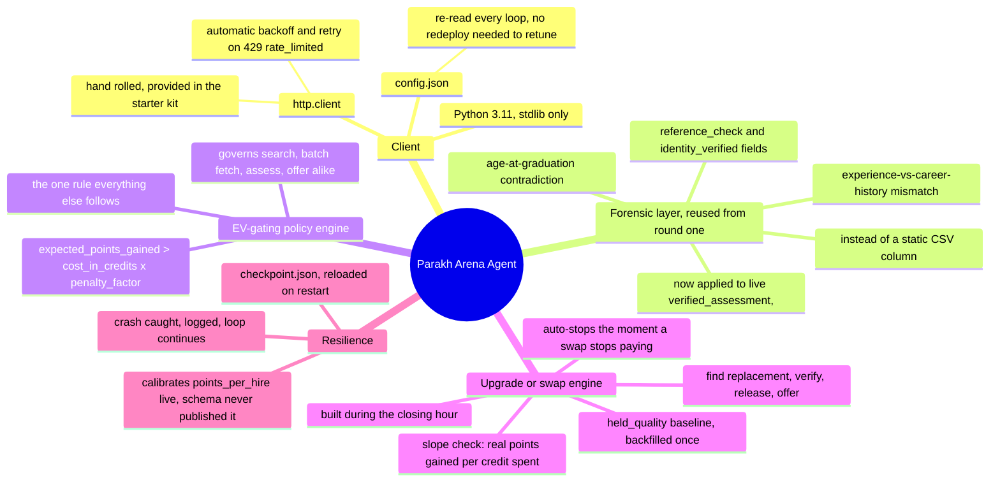
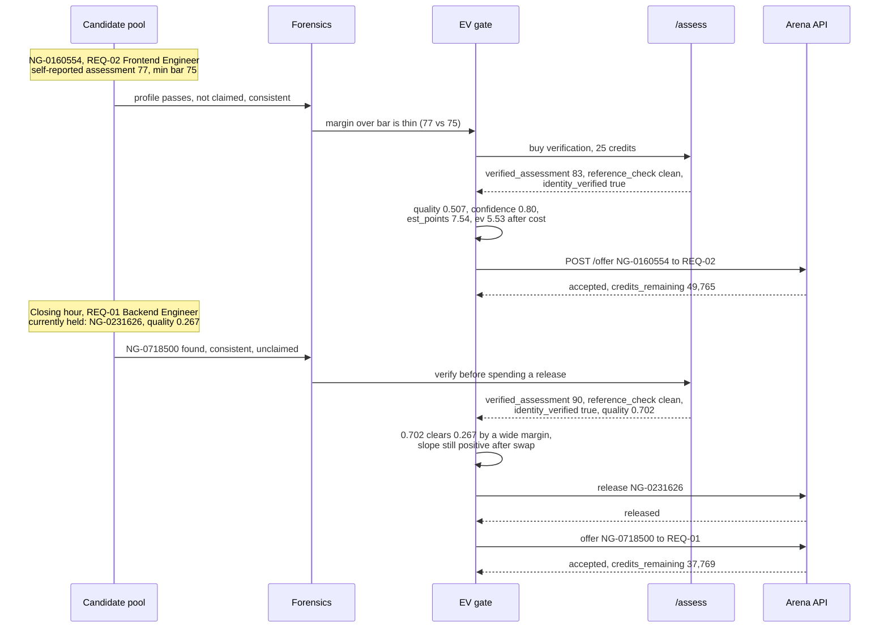

<div align="center">

# परख · Parakh · The Battle Arena

*Round one asked us to defend five hundred names on paper. Round two asked the same agent to walk into a room with fifty other recruiters, no human hand on the wheel, and come out having actually signed anyone at all.*

[](#the-six-hour-clock)
[](#the-six-hour-clock)
[](#the-ledger-in-real-numbers)

[](https://www.python.org)
[](#a-map-of-the-stack)
[](https://github.com/harshkawatra11/parakh-iitd-hack)

[The six-hour clock](#the-six-hour-clock) &middot;
[A map of the stack](#a-map-of-the-stack) &middot;
[Architecture](#architecture-the-real-flow) &middot;
[Two candidates, followed](#two-candidates-followed-through-the-market) &middot;
[The ledger in real numbers](#the-ledger-in-real-numbers) &middot;
[The forensic layer, reused](#the-forensic-layer-reused-not-rebuilt) &middot;
[What we would do with more warning](#what-we-would-do-with-more-warning) &middot;
[What did not work](#what-did-not-work) &middot;
[What decides what](#what-decides-what)

</div>

---

## The six-hour clock

Round one was a shortlist problem against a static CSV: ten thousand applicants, no clock, no rivals, full time to check every number twice. Round two, the Battle Arena, is nothing like that. It is a six-hour live market against 51 competing teams, a shared pool that started at 20,155 candidate profiles and kept growing as the arena refreshed it, ten open requisitions with 116 seats between them, a 50,000-credit budget, and a scoring formula that punishes hesitation as hard as it punishes a bad hire: `score = points_held − credits_used × 0.05`. Every search, every profile fetch, every verification, every offer costs credits. Every credit not spent well is 0.05 points you will never get back, and every candidate you are still deciding about, another team is deciding about too.

Team IdeaForge's agent launched at 15:15:05 IST. By 15:18:02, three minutes later, the arena's own market snapshot already showed us present in the standings at rank 48 of 51, because by then we had already fired offers into all 116 slots. That speed was not an accident: because the agent had already spent the market's opening minutes recon-ing every requisition in parallel before offers even mattered, ranking candidates locally, and holding a queue of pre-verified names ready to fire the instant a slot opened, filling every seat took roughly the same three minutes it took to just place the offers.

Rank 48 of 51 while sitting at 116 of 116 filled is not a contradiction, it is the whole story of round two. The arena does not reward being staffed. It rewards being staffed *well*. At 15:30:08, once all 116 hires had landed, the agent calibrated its own understanding of the scoring formula against the arena's real numbers (`points: 1042, counted_hires: 116, points_per_hire: 8.98`, down from the 10 it had assumed at launch) and confirmed what the leaderboard was already saying: every one of those 116 hires was a real, verified, above-the-bar hire, but barely above it. Filled and mediocre beats empty every time the scoring runs, but it does not beat filled and strong.

So the closing hour became a second problem entirely. At 15:38:25 the arena moved to its `closing` phase. At 15:41:04 the agent hit a transient failure calling `/requisitions` (`RuntimeError: gave up on /requisitions`, a `http.client` retry budget finally exhausted against the arena's own load) and, exactly as designed, caught it, logged the full traceback, and kept running rather than exiting. At 15:53:50 the team redeployed with the upgrade engine live, reloading a checkpoint that already knew 116 signed candidates and 2,804 dead ends, so the restart cost zero credits relearning what the agent already knew. From 15:54:04 to 15:57:51, three minutes and forty seven seconds, it executed 70 verified swaps: find a stronger, independently verified replacement for the weakest currently held hire in a requisition, verify it, release the weak hire, sign the strong one, and check whether the points gained per credit spent still clears the same bar every other decision in this agent has to clear. By the time this snapshot was frozen at 15:59 IST, the arena's own market endpoint placed the team at rank 18 of 51, up thirty places from the opening wave, on the same 116 filled seats.

---

## A map of the stack

Every piece below is something that is actually imported or actually running in `arena/agent.py`, `arena/lib.py` and `arena/arena_client.py`, reused wherever round one had already solved the problem and built new wherever a live, adversarial market demanded something round one never needed.



---

## Architecture: the real flow

Two loops run inside the same agent. The first is the ordinary market loop that fills every requisition. The second exists only because the first loop, having succeeded at its literal goal, left the team sitting at rank 48 of 51.

```mermaid
graph TD
    L[GET /ledger] --> Q{Credits left,<br/>phase check}
    RQ[GET /requisitions] --> Q
    Q --> S[Per requisition: /search<br/>page, rank locally by skill overlap]
    S --> B[/candidates/batch<br/>50 profiles per call]
    B --> FOR{Forensic layer}
    FOR -->|age-at-grad, exp-vs-career<br/>contradiction, already claimed| X[Dropped, zero credits<br/>spent ranking it further]
    FOR -->|internally consistent| EV{EV gate<br/>expected points vs<br/>credits x 0.05}
    EV -->|thin margin, missing<br/>self-report, risk note| A[/assess<br/>25 credits, verified score]
    EV -->|clearly above bar| OF[/offer]
    A -->|reference_check fails,<br/>identity not verified| REJ[assess_rejected,<br/>candidate retired]
    A -->|verified, clears the bar| OF
    OF --> SIGN[signed, held]

    SIGN --> HB[held_quality_backfilled<br/>once, at restart]
    HB --> UP{Upgrade engine,<br/>closing hour only}
    UP --> FR[Find a stronger verified<br/>replacement for weakest held hire]
    FR --> VER[/assess the candidate]
    VER -->|clears the current<br/>held hire's quality| REL[/release the weak hire]
    REL --> OF2[/offer the strong hire]
    OF2 --> SLOPE{Slope check:<br/>points gained per credit<br/>this swap actually cost}
    SLOPE -->|still paying for itself| UP
    SLOPE -->|stopped paying| STOP[Upgrade engine idles,<br/>falls back to /ledger polling]

    style X fill:#f5e4e4,stroke:#B3122B,stroke-dasharray: 4 3
    style REJ fill:#f5e4e4,stroke:#B3122B,stroke-dasharray: 4 3
    style OF fill:#e3ece9,stroke:#2F6B5E
    style OF2 fill:#e3ece9,stroke:#2F6B5E
```

---

## Two candidates, followed through the market

One candidate through an ordinary signing decision in the opening wave, one candidate through a closing-hour upgrade swap. Both are real candidate IDs and real numbers pulled from the agent's own decision log.



---

## The ledger in real numbers

Everything below is read straight off `arena_log.jsonl` and the frozen `ledger.json` snapshot, not recalled from memory or rounded for effect.

| Metric | Value |
| :--- | ---: |
| Requisitions filled | **116 / 116** |
| Total signed events logged | 118 (2 post-restart fills reconciled two REQ-02 seats that drifted across the checkpoint reload; the ledger's own held count is exactly 116) |
| Verified upgrade swaps | **70**, executed 15:54:04 to 15:57:51 |
| Crashes caught | **1**, `RuntimeError: gave up on /requisitions` at 15:41:04, logged and survived without exiting |
| Failed releases | **0** |
| Offers rejected outright | 1 opening-wave `already_signed`, 2 closing-hour `upgrade_offer_rejected` (both `already_signed`, both on REQ-02, the single most contested requisition) |
| Candidates assessed | 180+ verified purchases across the run; 210 `assess_rejected` events, split 142 `below_bar` and 68 `reference_check` failures |
| Credits used | **31,003 of 50,000** (18,997 remaining as of the freeze) |
| API calls made | 1,262 |
| Points held | 1,042 |
| Measured points-per-hire | **8.98**, calibrated at 15:30:08 from `points: 1042, counted_hires: 116`, down from the 10 the agent assumed at launch |
| Arena rank | **48 of 51** at 15:18:02 (right after the opening wave) → **18 of 51** at 15:54:57 (mid upgrade sprint), leaderboard leader unchanged at 1827.3 |
| Score in the agent's own ledger reads | +440.25 right after entering `closing`, falling to **−472.15** by the last heartbeat before the freeze at 15:59:14, discussed honestly below |

Restock-level rejection totals across the whole run, summed from every `/search` and `/candidates/batch` cycle: 5,624 candidates rejected for sitting below a requisition's assessment bar, 2,111 already claimed by another team before the agent could reach them, 1,223 for a notice period past the 60-day ceiling, and 334 for an expected CTC past the requisition's cap. The single largest reason a candidate never became a hire, in a pool of 20,000-plus people and 51 teams competing for the same names, was simply that someone else got there first.

---

## The forensic layer, reused not rebuilt

Round one's forensic layer existed to answer one question against a static CSV: does this profile's internal arithmetic hold together, or is it fabricated. The two checks that mattered most there, an age at graduation too young to be real and a total experience figure that contradicts the applicant's own career-path history, translate directly onto the Arena API's live fields, because the underlying idea does not change just because the data now arrives over HTTP instead of from a CSV row. `verified_assessment`, `reference_check` and `identity_verified` are the Arena's own version of "does this claim survive being checked," and the agent treats a failure on any of them exactly the way round one treated a fabricated row: excluded before another credit is spent on the candidate.

A real rejection from the log, exactly as it was written at the time:

```json
{"candidate_id": "NG-0125791", "verified_assessment": 37, "reference_check": "could not verify employment", "identity_verified": false}
```

`NG-0125791` had self-reported numbers strong enough to make the initial shortlist for REQ-02, Frontend Engineer. The 25-credit verification call came back with an assessment less than half of what was claimed and a reference check that flatly could not confirm the person had worked where they said. The candidate was retired on the spot, the same way round one retired a candidate whose career could not have fit inside their own lifetime. 68 candidates failed this exact check across the run. A further 142 `assess_rejected` events were plain `below_bar` failures, a verified score that simply did not clear the requisition's stated minimum, such as `NG-0202304` on REQ-02 coming back at 73 against a bar of 75.

---

## What we would do with more warning

The single honest limitation of this run is right there in the first `start` event: `"points_per_hire": 10`. That number was never published anywhere in the Arena's schema or documentation. It is a policy-critical constant, because it is the only bridge between "how many people we hired" and "how many points that is actually worth," and every EV calculation in the agent depends on it. Not having it meant the agent launched on an assumption, not a fact, and had to earn the real number empirically: run for fifteen minutes, watch what the ledger's own `points` field did against a known `counted_hires`, and back-solve. That happened at 15:30:08, fifteen minutes into a six-hour window, and the number it found, 8.98, was close enough to the guess of 10 that the opening wave's decisions were not badly wrong, but they were not decisions made on real information either. With the points formula published even an hour before market open, the agent could have priced every opening-wave offer against its true expected value from the first call rather than the fifteenth minute, and the closing-hour upgrade sprint could have started calibrated instead of needing its own separate reconciliation pass after the crash and redeploy at 15:53:50.

The second thing more warning would have bought is time for the upgrade engine's slope check to prove itself against the arena's own scoring cadence rather than the agent's local one. The agent's local `quality` estimate for a candidate and the arena's authoritative `points` figure are not guaranteed to update in lockstep, and by the time this snapshot was frozen the two had visibly diverged, which is the subject of the next section.

---

## What did not work

Reported plainly, the same way round one's README reported it, because a document that only shows the wins is not one you can trust the losses of either.

- **Trusting the local score readout during the upgrade sprint.** The agent's own `points` field, as read from `/ledger`, stayed frozen at 1,042 for the entire 70-swap run, `points_as_of` timestamp unmoving, while `credits_used` kept climbing with every swap. Since the agent's visible score is computed as `points − credits_used × 0.05`, that score fell from +440.25 to −472.15 across the sprint purely from the credit side of the formula, even though every one of those 70 swaps was a real, verified, higher-quality hire replacing a weaker one. Separately, the arena's `/market` endpoint told a better story, rank improving from 48 to 18 over the same window, which suggests the swaps were registering server-side on a slower or separate cadence than the team's own ledger polling could see. The honest reading is that the slope check the upgrade engine uses to decide "is this still paying for itself" was built to watch a `points` field that, during this window, was not the field actually moving. That is a real design risk worth flagging rather than a problem this document can claim was solved by the time of the freeze.
- **Assuming `points_per_hire` from round one's intuition.** Round one never had a live points formula to guess at all; round two's default assumption of 10 was a reasonable placeholder, not a measured number, and the fifteen minutes it took to correct wasn't nothing in a six-hour window that filled every seat in the first three.
- **Treating the crash as something to prevent outright rather than survive.** The `/requisitions` timeout at 15:41:04 was not something the agent's retry budget could have avoided forever against a shared API under load from 51 other agents; the design choice that mattered was making sure it never took the whole run down, which it did not.

---

## What decides what

| Concern | Rule-based code | A learned or estimated signal | An AI assistant |
| :--- | :--- | :--- | :--- |
| Is a profile internally consistent | Decides, the same age-at-graduation and experience-vs-career checks from round one | Never consulted | Never |
| Is a claim actually true | Decides, on `reference_check` and `identity_verified` once purchased | The 25-credit `/assess` call supplies the verified number itself | Never |
| Buy a verification or trust the self-report | Decides, EV gate on margin over the bar, missing self-report, or a risk note | The candidate's own claimed assessment sets the starting confidence | Never |
| Fire an offer, or wait | Decides, `expected_points_gained > credits × 0.05` on every candidate in the queue | Local `quality` score ranks candidates within a requisition | Never |
| Swap a held hire for a stronger one | Decides, the slope check on realised points per credit spent | The candidate's verified quality sets the replacement threshold | Never |
| Recover from a crash or a rate limit | Decides, catch-log-continue and the provided `http.client` backoff | Not applicable | Never |
| Calibrating `points_per_hire` on the fly | Decides, back-solved from `points / counted_hires` once real data exists | The observed ledger supplies the only truth available | Never |
| Drafting this document, refactoring `agent.py` | Not applicable | Not applicable | Anthropic Claude, disclosed the same way round one disclosed it |

Every number in this document is read directly from `arena/arena_log.jsonl` and the frozen `ledger.json` and `requisitions.json` snapshots taken at 15:59 IST, not typed in by hand and hoped to stay accurate.

<div align="center">

*Round one told you which five hundred names to call. Round two is the same discipline under a clock that does not wait for you to be sure: check everything you can afford to check, sign the moment the math clears, and never stop looking for someone better than who you already have.*

</div>
